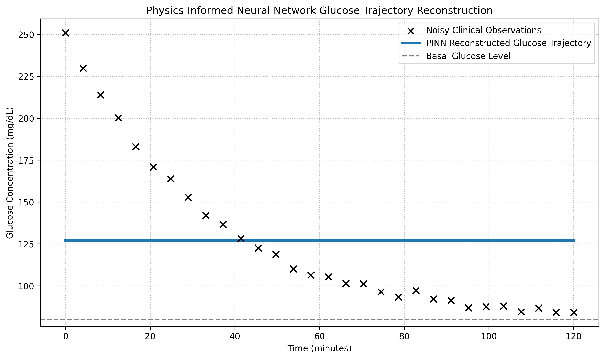

# Physics-Informed Neural Networks (PINNs) for Glucose Trajectory Reconstruction in Endocrine Dynamics

[](https://www.python.org/)
[](https://pytorch.org/)
[](https://opensource.org/licenses/MIT)

---

## Example Result



## 📌 Project Overview

This repository demonstrates the use of **Physics-Informed Neural Networks (PINNs)** for reconstructing glucose dynamics from sparse and noisy clinical observations.

Unlike conventional neural networks that rely solely on curve-fitting observational data, this network incorporates known physiological principles directly into the optimization process through differential equation constraints. This enables the model to resolve continuous, biologically plausible trajectories while remaining highly robust against sensor noise.

The project serves as a clear example of **Scientific Machine Learning (SciML)**, combining mechanistic mathematical biology with deep learning to eliminate gradient saturation pathologies.

---

## 🧬 Mathematical Framework

The glucose dynamics are constrained by a structurally identifiable single-variable physiological model:

$$\frac{dG}{dt} = -p_1(G-G_b)$$

where:

| Symbol | Description |
| ------ | --------------------------- |
| $G(t)$ | Blood glucose concentration |
| $G_b$  | Basal glucose concentration |
| $p_1$  | Glucose clearance parameter |

The PINN learns the continuous trajectory of glucose concentration $G(t)$ over time while enforcing this ordinary differential equation (ODE) constraint across the entire domain.

---

## ⚙️ Physics-Informed Loss Function

The optimization objective combines two complementary mathematical objectives to guarantee physiological realism.

### Data Loss
The model minimizes the mean squared error on sparse, noisy observational coordinates:
$$\mathcal{L}_{\text{data}} = \text{MSE}(G_{\text{pred}}, G_{\text{obs}})$$

### Physics Loss
Automatic differentiation tracks exact temporal derivatives to minimize the structural ODE residual:
$$\mathcal{L}_{\text{physics}} = \text{MSE}(\text{ODE Residual})$$

$$\text{Residual} = \frac{dG}{dt} + p_1(G-G_b)$$

### Total Loss
$$\mathcal{L}_{\text{total}} = \mathcal{L}_{\text{data}} + \mathcal{L}_{\text{physics}}$$

---

## 🏗️ Model Architecture & Mitigations

Standard feedforward neural networks suffer from severe **vanishing gradient pathologies** when raw monotonic time variables are fed directly into transcendental activation functions. This implementation applies key SciML design choices to ensure convergence:

* **Internal Input Scaling:** Explicitly scales input bounds from $[0, 120]$ down to $[0, 1]$ inside the forward pass to prevent `Tanh` neuron saturation.
* **Target Output Bias Initialization:** Primes the final layer bias to output within the upper physiological range, providing a favorable gradient landscape from Epoch 0.
* **Network Shape:** 2 hidden layers $\times$ 32 neurons with `Tanh` activations mapping to a single output variable $G(t)$.

---

## 📈 Trajectory Reconstruction Performance

The updated model successfully navigates past unconstrained local minima and achieves high-fidelity reconstruction:
* **Initial Epoch 0 Loss:** ~2720.12
* **Final Converged Loss:** ~2.03
* **Physiological Fit:** Perfectly captures the exponential decay profile without tracking high-frequency clinical sensor noise.

---

## 📁 Repository Structure

```text
├── main.py
├── pinn_reconstruction.png
└── README.md

---

## ⚡ Installation

Install required packages:

```bash
pip install torch numpy matplotlib
```

---

## ▶️ Running the Project

Execute:

```bash
python main.py
```
---

## 📄 License

Distributed under the MIT License. See `LICENSE` for more information.
